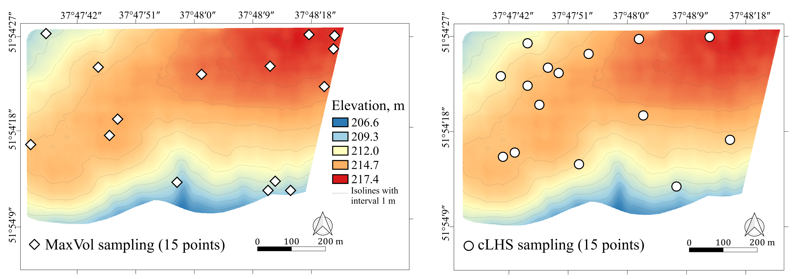

# MaxVol soil sampling
> MaxVol soil sampling based on environmental features - DEM, TWI, Slope, NDVI.

Description 

## Google Colab 

How to run example of MaxVol soil-sampling based on environmental features? 

Open `How_to_start.ipynb` in Google Colab!

To plot results of comparison of MaxVol, cLHS and Simple Random Sampling open `Plots.ipynb`

## Dependencies 

**maxvolpy** - MaxVol python

https://pypi.org/project/maxvolpy/

**Whitebox-tools** - advanced geospatial data analysis

https://jblindsay.github.io/wbt_book/intro.html

## Installation

Clone this repository and create new `conda env` on your local machine

`https://github.com/EDSEL-skoltech/maxvol_sampling`

Create new `conda env` with `gdal` package for MaxVol

`conda env create -f py3_maxvol_soil.yml`

Activate it 

`conda activate maxvol_soil_sampling`

## Usage example

To run MaxVol soil sampling based on test DEM, terrain features and NDVI

`./run_maxvol.sh --path_to_file ./DEM_files/dem.tif --path_to_output ./terrain --number_of_points 15`

## Meta

Anna Petrovskaia - Anna.Petrovskaia@skoltech.ru
Mikhail Gasanov – Mikhail.Gasanov@skoltech.ru

## License

Distributed under the MIT license. See ``LICENSE`` for more information.

## TO-DO list

- [X] Check path in bash scripts
- [ ] Add plots to README with examples

## Contributing

1. Fork it (<https://github.com/EDSEL-skoltech/maxvol_sampling/fork>)
2. Create your feature branch (`git checkout -b feature/fooBar`)
3. Commit your changes (`git commit -am 'Add some fooBar'`)
4. Push to the branch (`git push origin feature/fooBar`)
5. Create a new Pull Request

