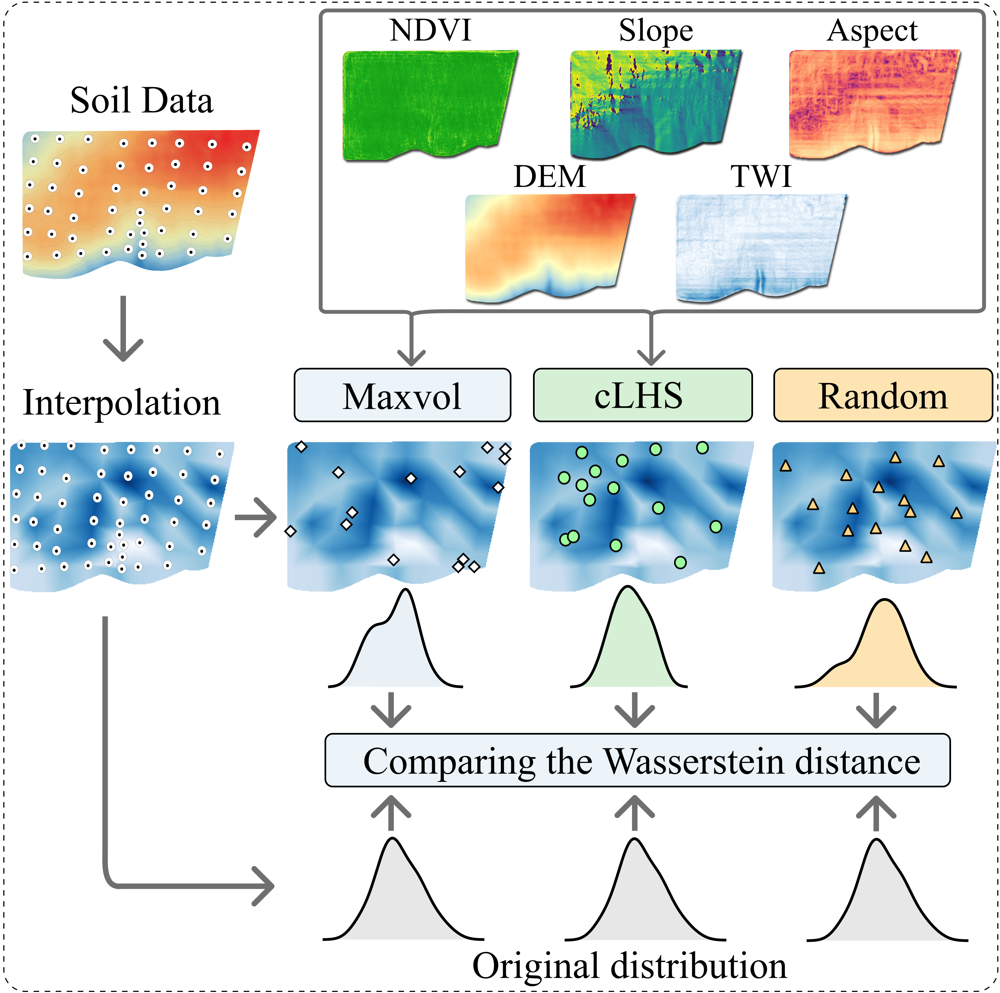

# MaxVol soil sampling
> MaxVol soil sampling based on environmental features - DEM, TWI, Slope, NDVI.

We propose a machine learning approach based on the crop simulation model WOFOST to assess the crop yield and water use efficiency. In our work, we use historical weather to evaluate extreme weather scenarios. The application of multi-criteria optimization based on the non-dominated sorting genetic algorithm-II (NSGA-II) allows users to find the dates and volume of water for irrigation, maximizing the yield and reducing the water loss.

## Google Colab 

How to run example of MaxVol soil-sampling based on environmental features? 

Open `How_to_start.ipynb` in Google Colab!

To plot results of comparison of MaxVol, cLHS and Simple Random Sampling open `Plots.ipynb`

## Dependencies 

maxvolpy - MaxVol python

https://pypi.org/project/maxvolpy/

Whitebox-tools - advanced geospatial data analysis

https://jblindsay.github.io/wbt_book/intro.html

## Installation

Clone this repository and create new `conda env` on your local machine

`https://github.com/EDSEL-skoltech/maxvol_sampling`

Create new `conda env` with `gdal` package for MaxVol

`conda env create -f py3_maxvol_soil.yml`

Activate it 

`conda activate maxvol_soil_sampling`

## Usage example

To run multi-objective MaxVol soil sampling based on test data

`./run.sh --path_to_file ./DEM_files/10_3857_5m.tif --path_to_dir ./DEM_files/terrain_features`

## Meta

Anna Petrovskaia - anna.petrovskaia@skoltech.ru
Mikhail Gasanov – Mikhail.Gasanov@skoltech.ru

## License

Distributed under the MIT license. See ``LICENSE`` for more information.

## TO-DO list

- [X] Check path in bash scripts
- [ ] Add plots to README with examples

## Contributing

1. Fork it (<https://github.com/EDSEL-skoltech/multi_objective_irrigation/fork>)
2. Create your feature branch (`git checkout -b feature/fooBar`)
3. Commit your changes (`git commit -am 'Add some fooBar'`)
4. Push to the branch (`git push origin feature/fooBar`)
5. Create a new Pull Request

